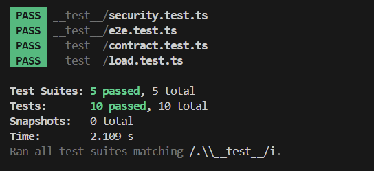

# Warehouse Management Web Software Testing

## 📦 Repository Contents

Repositori ini berisi hasil pekerjaan tim dalam menyelesaikan tugas proyek software testing untuk user story Sistem Pergudangan (STR02)

### ✅ Fitur dan Acceptance Criteria

#### Fitur 1: [Nama Fitur]
- Deskripsi: [Penjelasan fitur]
- Acceptance Criteria:
  - [AC1]
  - [AC2]
  - ...

#### Fitur 2: [Nama Fitur]
- Deskripsi: ...
- Acceptance Criteria:
  - ...

### 👥 Pembagian Role dan Deskripsi Tugas
| Nama Mahasiswa                                 | Role                       | Deskripsi Tugas                                                        |
|------------------------------------------------|----------------------------|------------------------------------------------------------------------|
| Emir Abe Putra A - 22/499337/TK/54742          | Frontend Dev               | Implementasi UI, integrasi API, dan unit testing frontend              |
| Hafidh H - 22/498640/TK/54706                  | Backend Dev                | Pembuatan API dan unit testing backend                                 |
| Aisa Selvira Q.A - 22/498561/TK/54690          | QA                         | Penulisan test case dan coverage analysis, user acceptance testing     |

### 📸 Hasil Pengujian

#### 🔹 Screenshot Hasil API Test

#### 🔹 Screenshot Coverage Unit Test

### 🖥️ Slide Presentasi
Tautan ke slide: [Google Slides](https://docs.google.com/presentation/d/1F75Uo4i4qnRPbH0czGJfPy5RJsXQPQFx/edit?usp=sharing&ouid=111007761289601157187&rtpof=true&sd=true)

